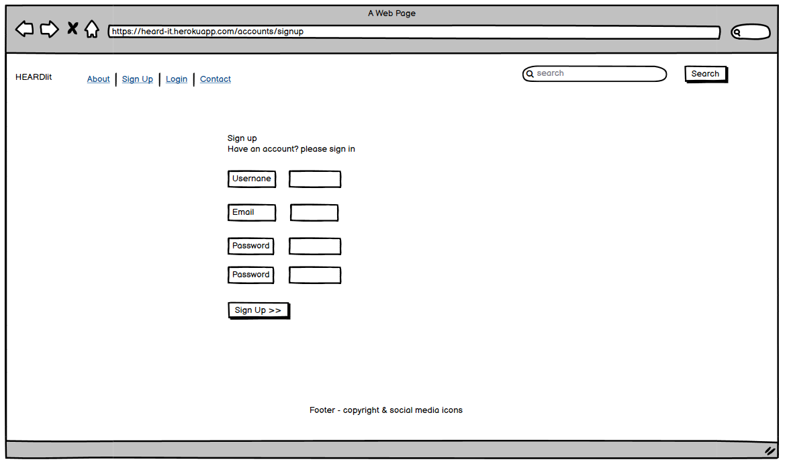
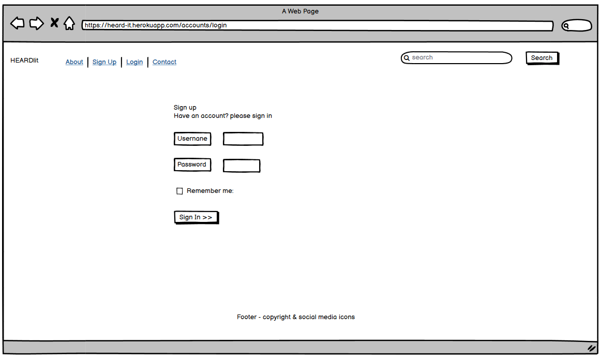
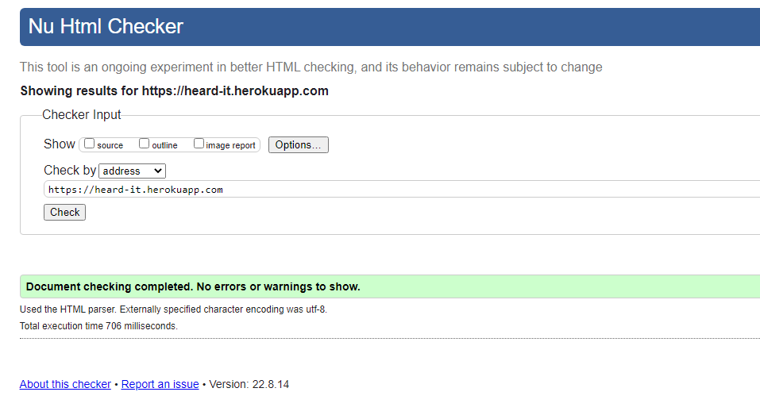

# HEARD|it

## Introduction
HEARD|it is an Irish technology news website which encourages users to Create, Read and Shape the news with a focus on technology start-ups.

## Showcase

### Live Website
A deployed link to the website can be found [here](https://heard-it.herokuapp.com/)

### Video
A video tutorial outlining some features can be viewed [here](https://res.cloudinary.com/dzyxqqpzh/video/upload/v1661179800/bandicam_2022-08-22_15-47-32-821_ch0xqw.mp4)

### QR Code

 

  
Click here to see QR Code

  

  

# Table of Contents
- [Table of Contents](#table-of-contents)
- [Introduction](#introduction)
- [UX](#ux-user-experience)
- [Agile Development Process](#agile-development-process)
- [Design](#design)
- [Features](#features)
- [Technologies Used](###technologies-used)
- [Testing](#testing)
- [Deployment](#deployment)
- [Credits](#credits)
- [Acknowledgements](#acknowledgements)

## UX User Experience
### User Stories

### As the site creator/admin:
* I want to have full access and functionality as a superuser
* I want to be able to create, read, edit and delete all post(s) / article(s)
* I want to be able to view / reject pending posts from users before publication

### As the site user:
* I want to be able to register an account
* I want to be able create, read, edit and delete my post(s) / article(s)
* I want to be able to leave comments on all posts
* I want to be able to Like & unlike post(s) / article(s)
* I want to be able to view all other posts / articles by using the search functionality
* I want to be able to make changes to the post by editing post(s) / article(s)
* I want to be able to Remove / delete post(s) / article(s) permanently

## Agile Development Process
* I used GitHub for Automated Kanban Project Management. [Click Here](https://github.com/sherryrich/heard-it/blob/main/docs/project_user_stories.PNG)
* I used GitHub project board to generate user story templates.
* I used project templates to speed up the process. 
* I used the automated kanban process and when It is connected to my repo. This allowed me to monitor, track and create user stories.
* In my developer environment when I used the keyword "resolve #card_number" in my commit message this automatically moved the card would move to completed column.

## Design
### Wireframes
 

  
Click here to view all wireframes both Desktop & mobile 

  
  
  
  
   
  
  

  
  
  
  
  
  
  

  

### Navigation

  
Click here to view website navigation 

  

  

### Color Palette

 

  
Color Palette

  

  

## Features
### Existing Features

### Home Page
Homepage displays the Navbar Brand / logo name, About, Sign Up & Login options on the left and search function on the right.
There is a H1 heading describing what the website is about so that users understand the websites function and target audience.
The main body of the homepage contains 6 articles / posts and once more than 6 articles are posted pagination shows links to the next page.
Social media network links are displayed in the footer.

### Navigation Bar
When not logged in the Navbar displays links to About, Sign Up & Login.
When a user hovers over navigation links a thin border appears at the bottom of the links to show responsiveness when the user interacts with the link element(s). When a user is logged in the Navbar displays links to About, Post Article & Logout.

### Search Page
When a user searches a particular word the result will return articles which contain the word searched with the string "You searched for". Example below user searched "jobs"

### Search Article - No Results

### About
A short introductory page informs the user(s) when the website was formed and what it aims to achieve and industry awards it has won.

### Sign up
When a user goes the Login page they are shown a simple form with username and password to sign in.

### Log in
When a user goes to the Login page they can enter account details as above. If a user however has not created an account yet, they are advised to sign up first.

### Log in messaging 
When a user logs in successfully a message is displayed for 3 seconds to confirm. This message then is removed.

### Log out
When a user goes to the Logout they are advised to confirm if they want to sign out before further action is taken.

### Log out messaging
When a user logs out successfully a message is displayed for 3 seconds to confirm. This message then is removed.

### Admin - Superuser Access

### Post Article

### Edit / Delete Article

### Article View

### Comment Awaiting Approval

### Contact Page

### Contact Page Djano Admin

### Social Links
The footer contains various social network links (Facebook, Twitter, Instagram and YouTube) and Copyright information.

### 404 Page
A 404 page was created to handle potential user navigational errors and give user a link to direct them back to the homepage.

### 500 Page
A 500 server error page was created to handle internal server errors.

## Future Features
* Allows users to signup to a newsletter / mailing list.
* Allow users to report already approved content.
* Host audio content for podcasts.
* Allows users to filter by most read or most commented on articles.
* Allow users to contribute to financially support ongoing publication by way of donations.

## Bugs encountered during development
* Manage.py was not in the root directory. [Click here](https://github.com/sherryrich/heard-it/blob/main/docs/error_1.png)
* App wasn’t deploying to heroku correctly. Updated Procfile from "heard-it" to "heardit"
* Update your requirements.txt - pip3 freeze > requirements.txt and try again. I had a typo in requirements without .txt. [Click here](https://github.com/sherryrich/heard-it/blob/main/docs/error_2.png)
* Template literal typo error "$" instead of "%". [Click here](https://github.com/sherryrich/heard-it/blob/main/docs/error_3.png)
* Error in views.py. '-created' versus '-created_on'. [Click here](https://github.com/sherryrich/heard-it/blob/main/docs/error_4.png)
* Missing comma at the end of this line "STATICFILES_DIRS = [os.path.join(BASE_DIR, 'static'), ]". [Click here](https://github.com/sherryrich/heard-it/blob/main/docs/error_5.png)
* 500 Error because I didn’t have "redirect" imported at top of views.py file. [Click here](https://github.com/sherryrich/heard-it/blob/main/docs/error_6.png)
* Error in the terminal. Heroku updated database so had go to Heroku config vars and copy and paste the new database_url into the env.py to correct. [Click here](https://github.com/sherryrich/heard-it/blob/main/docs/error_7.png)
* Space in the token provided. Caused CSS not to display on the front end as expected. [Click here](https://github.com/sherryrich/heard-it/blob/main/docs/error_8.png)
* Missing closing span. Caused HTML to fail validator rules. [Click here](https://github.com/sherryrich/heard-it/blob/main/docs/error_9.png)
* Search Button was missing on smaller devices so I added a media query and reduced the size of the element on smaller devices. Please see screen shots [Before](https://github.com/sherryrich/heard-it/blob/main/docs/search_box_before.PNG) and [After](https://github.com/sherryrich/heard-it/blob/main/docs/search_box_after.PNG). 

### Unfixed Bugs
No known unfixed bugs present at the time of submission

## Technologies Used
### Languages Used
  * [HTML5](https://developer.mozilla.org/en-US/docs/Web/HTML)
  * [CSS3](https://developer.mozilla.org/en-US/docs/Web/CSS)
  * [JavaScript](https://www.javascript.com/)
  * [Python](https://www.python.org/)

### Frameworks, Libraries & Programs Used
* [amiresponsive](http://ami.responsivedesign.is/) to see how responsive the site is on different devices.
* [Balsamiq](https://balsamiq.com/) was used to create the Wireframes.
* [Cloudinary](https://cloudinary.com/) was used to upload, store, manage, manipulate, and deliver images.
* [Color-hex](https://www.color-hex.com/) once I identified the colors I wanted I used color-hex to generate the palette.
* [Django](https://www.djangoproject.com/) is a free and open-source, Python-based web framework that follows the model–template–views architectural pattern.
* [Font Awesome](https://fontawesome.com/) was used for icons for aesthetic and UX purposes on the buttons.
* [Git](https://git-scm.com/) was used for version control by utilizing the Gitpod terminal to commit to Git and Push to GitHub.
* [GitHub](https://github.com/) GitHub is used to store the projects code after being pushed from Git.
* [Gitpod](https://www.gitpod.io/) An online IDE linked to the GitHub repository used to write my code.
* [Google Chrome Dev tools](https://developer.chrome.com/docs/devtools/) for debugging.
* [Google Lighthouse](https://developers.google.com/web/tools/lighthouse) used for audits to measure the quality of web pages.
* [Heroku](https://www.heroku.com/) used to deploy this app, a cloud platform as a service supporting several programming languages.
* [Pexels](https://www.pexels.com/) Images for this project were sourced from Pexels.
* [Unsplash](https://unsplash.com/) Images for this project were sourced from Unsplash.
* [WAVE](https://wave.webaim.org/extension/) Browser Extension testing.

## Testing

### Validation Testing
|  | Validations |  Pass/Fail |
| ------------- |-------------|  :----: |
| Chrome   | Lighthouse Report | Pass |
| HTML   | W3C Markup Validator | Pass |
| CSS   | W3C CSS Validator | Pass |
| Python   | PEP8 online | Pass |
| JS   | JSHint | Pass |

### Lighthouse Report
* Ran Lighthouse reports audits to gauge performance, accessibility, and SEO. Gain actionable and reportable insights in real time.
 

  
Click here to see the Lighthouse Report

  

  

### The W3C Markup Validator
  

  
Checked using W3C Markup Validator ensuring there were no errors or warnings present. Click here to see the W3C Markup Validator result

  

  

### W3C CSS Validator
  

  
Checked using W3C CSS Validator ensuring there were no errors or warnings present. Click here to see the W3C CSS Validator result

  

  

  ### PEP8 online 
  

  
Checked Python code is formatted according to the PEP 8 standards

  

  

  ### JSHint 
  

  
Checked JavaScript source code complies with coding rules

  

  

### Manual Testing
### Responsiveness
### Browser Compatibility

|  | Chrome | Firefox | Edge | Safari | Pass/Fail |
| ------------- |-------------| -----|  ---------- |  -----| :----: |
| Expected Appearance   | yes | yes  | yes  | yes | Pass |
| Expected Layout   | yes | yes  | yes  | yes | Pass |

## Deployment
* This project was developed using a GitPod workspace. The code was committed to Git and pushed to GitHub using the terminal.

* Log in to [Heroku](https://id.heroku.com/login) or create an account
* On the main page click New and Create New App
* Note: new app name must be unique
* Next select your region, I chose Europe.
* Click Create App button
* Click in resources and select Heroku Postgres database
* Click Reveal Config Vars and add new config "SECRET_KEY"
* Click Reveal Config Vars and add new config "CLOUDINARY_URL"
* Click Reveal Config Vars and add new config "DISABLE_COLLECTSTATIC = 1"
* The next page is the project’s Deploy Tab. Click on the Settings Tab and scroll down to Config Vars
* Next, go to Buildpack section click Add Buildpack select python and Save Changes
* Scroll to the top of the page and choose the Deploy tab
* Select Github as the deployment method
* Confirm you want to connect to GitHub
* Search for the repository name and click the connect button
* Scroll to the bottom of the deploy page and select the preferred deployment type
* Click either Enable Automatic Deploys for automatic deployment when you push updates to Github

### Final Deployment 

* Create a runtime.txt `python-3.8.13`
* Create a Procfile `web: gunicorn heardit.wsgi`
* When development is complete change the debug setting to: `DEBUG = False` in settings.py
* In this project the summernote editor was used so for this to work in Heroku add: `X_FRAME_OPTIONS = SAMEORIGIN `to
   settings.py.
* In Heroku settings, delete the config vars for `DISABLE_COLLECTSTATIC = 1`

### Forking This Project

* Open [GitHub](https://github.com/sherryrich/heard-it)
* Find the 'Fork' button at the top right of the page
* Once you click the button the fork will be in your repository

### Cloning This Project

* Clone this project by following the steps:

* Open [GitHub](https://github.com/sherryrich/heard-it)
* You will be provided with three options to choose from, HTTPS, SSH or GitHub CLI, click the clipboard icon in order
to copy the URL
* Once you click the button the fork will be in your repository
* Open a new terminal
* Change the current working directory to the location that you want the cloned directory
* Type 'git clone' and paste the URL copied in step 3
* Press 'Enter' and the project is cloned

## Credits

* Code Institute - Database Management Systems - Task Manager Walkthrough
* Code Institute - 'I think therefore I blog' - Django blog project Walkthrough
* Codemy.com Database Tables With Django - [YouTube](https://youtu.be/z5e_8FgKZig)
* Corey Schafer Python Django Tutorial [YouTube](https://www.youtube.com/c/Coreyms)
* Create A Simple Blog With Python and Django [YouTube](https://youtu.be/B40bteAMM_M)
* The Web Developer Bootcamp 2002 [Udemy](https://www.udemy.com/course/the-web-developer-bootcamp/)
* How to Use GitHub for Automated Kanban Project Management [YouTube](https://www.youtube.com/watch?v=YVFa5VljCDY)

## Acknowledgements
* To create this website, I relied on material covered in the Full Stack Development course by Code Institute.
* I also sourced information and help from a variety of sources such as Slack Community Channels, Udemy, W3Schools, MDN and YouTube for Online Web Tutorials and resources.
* Martina Terlevic for reviewing my work and providing valuable feedback and advice.
* Gerard McBride my Code Institute / UCD Facilitator and Masterclass tutor.
* Róisín Crilly for taking her free time to walk through P4 experience and help with code / logic.

This project is for educational use only and was created for the Code Institute Module.

Created by Richard Sherry 🙌